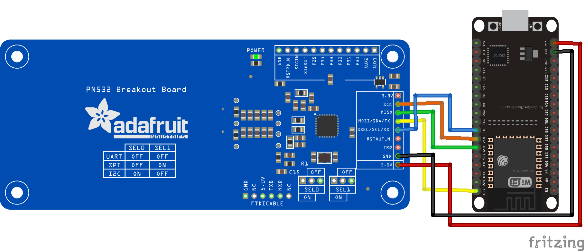

# esp32-pn532-micro
Contoh penerapan pn532 menggunakan platform micropyton pada board pn532

## Kebutuhan perangkat
+ Reader NFC PN532
+ TAG NFC, bisa menggunakan kartu mifare
+ ESP32 controller

## Rangkaian

> Versi fritzing dapat Anda dapatkan di [sini](esp32-pn532.fzz)

Dari rangkaian di atas, mapping antara reader PN532 dan ESP32 adalah sebagai berikut

ESP32            | PN532
---------------- | ----------------------
5V               | VCC 
GND              | GND
D18 (GPIO 18)    | SCK
D19 (GPIO 19)    | MISO
D23 (GPIO 23)    | MOSI
D5 (GPIO 5)      | SS

## Contoh kode
```python
import NFC_PN532 as nfc
from machine import Pin, SPI

# SPI
spi = SPI(1, baudrate=1000000, sck=Pin(18), mosi=Pin(23), miso=Pin(19))
cs = Pin(5, Pin.OUT)
cs.on()

# SENSOR INIT
pn532 = nfc.PN532(spi,cs)
ic, ver, rev, support = pn532.get_firmware_version()
print('Found PN532 with firmware version: {0}.{1}'.format(ver, rev))

# Configure PN532 to communicate with MiFare cards
pn532.SAM_configuration()

while True:
    print('Reading...')
    uid = pn532.read_passive_target(timeout=500)
    if uid is None:
        print('CARD NOT FOUND')
    else:
        numbers = [i for i in uid]
        string_ID = '{}-{}-{}-{}'.format(*numbers)
        print('Found card with UID:', [hex(i) for i in uid])
        print('Number_id: {}'.format(string_ID))
```

